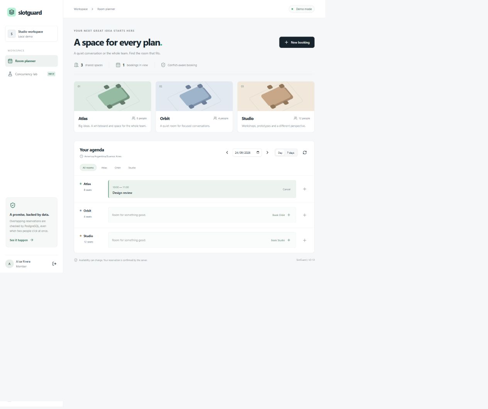
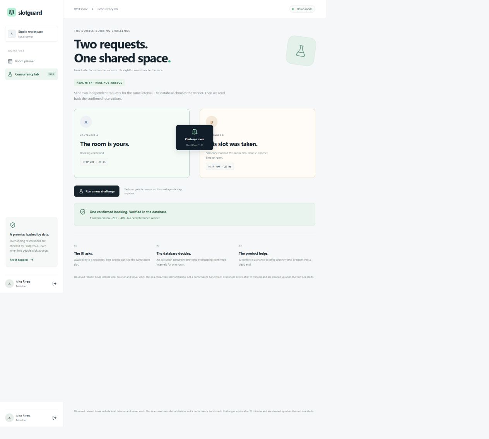

# SlotGuard


**One slot. Two requests. Fullstack booking, with concurrency you can see.**

[](https://github.com/DimaGutierrez/slotguard/actions/workflows/checks.yml)

[Español](README.es.md) · [Wiki](https://github.com/DimaGutierrez/slotguard/wiki) · [Discussions](https://github.com/DimaGutierrez/slotguard/discussions) · [Architecture](docs/architecture.md) · [Security](SECURITY.md)

Two people see an open room. Both click Book. SlotGuard makes the success, the conflict and the next step visible—with PostgreSQL protecting the reservation, not a disabled button.

**Status:** working v0.1 local fullstack prototype. One workspace per installation. No hosted service, external calendar sync, payments or background reminders. The banner is concept artwork; the app runs real HTTP requests and database transactions.

## See the race

1. Start the local demo and sign in as `alice` with `slotguard-demo`.
2. Open **Concurrency lab** and click **Run the challenge**.
3. Two browser HTTP requests compete for the same isolated room and interval.
4. Inspect the actual `201` and `409` responses, then the confirmed row count read from PostgreSQL.
5. In the planner, try an occupied interval and choose a suggested alternative.

The winner is not predetermined. Displayed request times are observations, not a benchmark. The 15-minute demo scenario is isolated from ordinary rooms and is cleaned up when a subsequent challenge starts.





## What is included

| Product experience | Backend behavior |
|---|---|
| Room cards, day / seven-day agenda and mobile layout | Bounded date-range queries, persistent reservations |
| Booking, cancellation and conflict alternatives | PostgreSQL exclusion constraint on confirmed intervals |
| Member and administrator sessions | Hashed passwords, revocable HttpOnly cookies, CSRF checks |
| Retry a request without creating another booking | Actor-scoped idempotency record and payload fingerprint |
| Administrator room creation and activity log | Server-enforced ownership/roles and transactional audit |
| Two-request concurrency challenge | Separate actors, real endpoint calls and persisted outcome |

The UI refreshes after mutations, on window focus, or manually. It is not a live push feed. Alternatives are suggestions from the refreshed view and are checked again on submission.

## Quick start: local Docker demo

Requires Docker with Compose. From the repository root:

```bash
cp .env.example .env
# Set POSTGRES_PASSWORD in .env to a long random alphanumeric value.
docker compose up --build
```

PowerShell: use `Copy-Item .env.example .env` for the first command. Open **http://127.0.0.1:8000** exactly; origin validation is enabled. The app is published only on loopback, and PostgreSQL has no published host port. The first build runs migrations and seeds fictional rooms and accounts.

Demo accounts: `alice`, `bob`, `admin`. Password for all three: `slotguard-demo`. These are intentionally public **local demo credentials**, not production defaults. Compose explicitly enables demo mode; application code defaults it off.

Stop with `docker compose down`. The named database volume is retained. Do not remove it unless you intend to delete the local data.

For Python/Node development, custom users, environment variables and troubleshooting, see [Setup](docs/setup.md). Native Windows PostgreSQL testing was performed locally; the CI workflow separately builds and smoke-tests Compose. Check the current workflow result rather than assuming a Docker pass.

## How overlapping bookings are prevented

The schema excludes overlapping `tstzrange(starts_at, ends_at, '[)')` values for the same room when status is `confirmed`. Adjacent bookings may touch at a boundary. Cancellation changes state and frees the interval in a transaction.

An availability query is advisory. The database arbitrates competing writes. The API translates an exclusion violation to HTTP `409`, then the interface helps the user choose again. Idempotency is separate: same actor + same key + same normalized payload returns the stored outcome, while key reuse with different input is rejected.

[Read the architecture and tradeoffs](docs/architecture.md). No exactly-once guarantee is made for external side effects.

## Stack and validation

React + TypeScript + Vite · FastAPI · SQLAlchemy + Alembic · PostgreSQL · pytest · Playwright. The UI uses project-local CSS and Lucide icons; no external font or AI service is required at runtime.

The test suite exercises overlap and adjacency, independent rooms, repeated HTTP races, simultaneous idempotent retries, role/ownership checks, session expiry, CSRF, equivalent timezone offsets and demo isolation. Browser tests cover booking, conflict alternatives, cancellation, a real race and logout at desktop and mobile sizes. See [verification notes](docs/verification.md).

## Join the conversation

- [The double-booking challenge](https://github.com/DimaGutierrez/slotguard/discussions/1): what should the second person see?
- [Where should the guarantee live?](https://github.com/DimaGutierrez/slotguard/discussions/2): share one tradeoff and the race you would test.
- [What should come next?](https://github.com/DimaGutierrez/slotguard/discussions/3): waitlist, reminders or recurrence—with a concrete use case.

English and Spanish are welcome. A small reproducible bug, a confusing screen or a useful alternative is a great contribution. [Contribution guide](CONTRIBUTING.md) · [Roadmap](docs/roadmap.md).

Created by [Diego Gutierrez](https://github.com/DimaGutierrez). MIT license. Concept artwork was generated with imagegen; [prompts and placement](assets/PROMPTS.md) are included.
