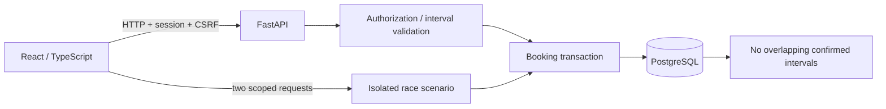

# Architecture and decisions

**[Try the public browser demo →](https://diegogutierrez.pages.dev/slotguard/)** — no installation or account required. Bookings, conflicts and the 201 / 409 race are simulated in this tab; reloading resets the examples. The full backend described below uses real HTTP requests and PostgreSQL when installed locally. [Demo scope](https://github.com/DimaGutierrez/slotguard/blob/main/docs/public-demo.md).

## Invariant

For a room, confirmed reservations cannot overlap. The migration creates an exclusion constraint using `btree_gist`, room equality and `tstzrange(..., '[)') &&`. Adjacent intervals are valid. Cancellation switches state and writes an audit event in the same transaction. The constraint, not a read-before-write check, arbitrates contenders.

Each sync API request runs in FastAPI's worker thread pool with a separate SQLAlchemy connection/transaction. A savepoint catches exclusion violations while preserving the outer idempotency record. Successful booking and audit record commit together; HTTP 201 is returned only after commit. A conflict returns 409.

## Idempotency

An advisory transaction lock is derived from actor + key. It serializes retries of the same operation, not competing users. The record includes a hash of normalized UTC interval, room and title, HTTP status and response. Same input returns the original outcome; changed input returns 409. The key is stored without automatic expiration in v0.1. Clients should generate a new key when the user initiates a new operation. Returning an old create result after cancellation does not recreate that reservation.

## Timezones

API inputs require explicit timezone offsets. PostgreSQL stores timezone-aware instants. The UI converts the configured workspace timezone with Luxon, rejects nonexistent/ambiguous local input, and displays the zone. Bookings last 15 minutes to 8 hours and start within one year. Equivalent offset representations are covered by API integration tests; broader DST-zone browser coverage remains a follow-up.

## Sessions and permissions

Passwords use scrypt with per-user salt. Random session tokens are hashed in the database and expire after eight hours. HttpOnly, SameSite=Strict cookies carry the token; mutating routes require an allowed Origin and session-bound CSRF header. Login is origin-checked. Demo booking capabilities are scoped to one scenario and actor instead of the administrator session.

Members can create reservations and cancel only their own. Administrators can cancel any reservation, create rooms and read audit history. Other members' titles are hidden in shared occupancy views. This is one workspace, not multi-tenant isolation.

## Demo lifecycle

The signed-in user creates a scenario with a new hidden room, two actor capabilities and one interval. The browser submits both requests using `Promise.all`, through the same booking service used by the planner. No fixed winner or injected success exists. The owner then reads the persisted confirmed count. Tokens expire after 15 minutes. New scenarios clean up expired demo rooms and their dependent data; ordinary rooms are never included. Cleanup is opportunistic, not a scheduler.

## Boundaries

Read queries are bounded, but the prototype has no total row/storage quota or retention scheduler. Rate limits are process-local. There is no public registration, password reset, MFA, email, external calendar integration or live push stream. SQLAlchemy uses explicit SQL so the PostgreSQL invariant is reviewable; Alembic owns versioned migrations. The frontend uses scoped project CSS rather than an additional styling runtime.

Reference: [PostgreSQL ranges and exclusion constraints](https://www.postgresql.org/docs/current/rangetypes.html#RANGETYPES-CONSTRAINT).
